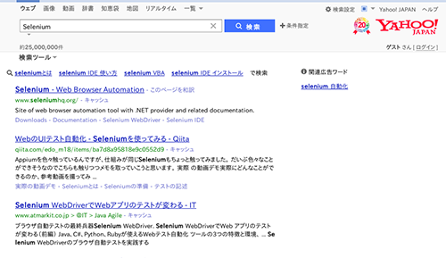

# とあるWebE2Eテストの環境構築

IT業界LT小規模発表勉強大会

@konkon1234

## 自己紹介

* 野村光司(@konkon1234)
* フリーランス3ヶ月目
* PHPやC#のお仕事が多め

## アジェンダ

* E2Eテストとは
* Selenium WebDriverを用いたテスト
* Headless Browserを用いたテスト
* 上のケースの問題の解決策を探る

## E2Eテストとは

開始から終了まで(End to End)が期待通りの動きをするかどうか確認するテスト

## E2Eテストとは

ユニットテストやコンポーネントテストで行うソースコードレベルのテストではなく主にGUI上でのテストが多い

Webでのテストはブラウザ自動操作によるテストが一般的です

* 会員登録が正常にできるか
* ユーザログインが正常にできるか
* ECサイトでクレジット購入が正常にできるか

## Selenium WebDriverを用いたテスト

### Selenium WebDriverとは

様々なブラウザを様々なプログラムで操作することができるWebアプリケーション用テストフレームワーク

### 主要ブラウザをサポート

* firefox(default)
* Chrome
* Internet Explorer
* Safari

### 公式にサポートされている言語も多数

* Java
* C#
* Ruby
* Python
* JavaScript(Node)

## Rubyでの例

yahooでSeleniumと検索する

~~~ruby
selenium = Selenium::WebDriver.for(:firefox)
selenium.get("http://www.yahoo.co.jp")
selenium.find_element(:id, "srchtxt").send_keys("Selenium")
selenium.find_element(:id, "srchbtn").click
~~~

### Selenium WebDriverを用いたテスト

便利だしガンガン書いていけばどんどんテストできる

ただ繰り返し使ってると不満も出てくる

### 不満

* テストの度にブラウザが立ち上がるので重い
* GUI操作なので重い
 * CIで回せなくなる
* 裏で作業してるとフォーカスの移動など挙動がおかしくなることがある

### 不満

ほぼGUIが絡んだ問題点

	そこでバックグラウンドで動くWebテストフレームワークはないか？と考える

	

		 
		 
		 
		やっぱりある
	

## Headless browserを用いたテスト

### Headless browserとは

GUIのないブラウザ

CUIで実行できる

### Headless browsers

色々と種類があるけど人気どころはこんなところか

* PhantomJS / webkit
* SlimerJS / Gecko
* CasperJS / PhantomJS or SlimerJSを使用
* nightmare / PhantomJS

etc

### 開発言語

JavaScriptが多い

### CasperJSでの例

~~~JavaScript
var casper = require('casper').create();
casper.start("http://www.yahoo.co.jp/", function() {
    this.waitForSelector("#srchtxt", function() {
        this.fillSelectors("#searchbox form", {
            "input#srchtxt": "Selenium",
        }, true);
    });
});
~~~

### 問題点

* ユーザが使うブラウザと異なる
* そのブラウザ特有の問題が発生する
 * 見た目が崩れる
 * 謎のエラーが発生する
 * Web上にも情報が少ない

 

テストブラウザの為のプロダクト修正は避けたい

## Xvfb + Selenium Web Driver

### Xvfbとは

X Window Systemの画面入出力をシミュレートするソフトウェア

メモリ上に仮想ウィンドウを構成する

### 今までの不満に対する解決策

Xvfb上にSelenium WebDriverで一般的なブラウザを立ち上げることで解決できるはず

### 環境構築

テスト環境

OS: Ubuntu 14.04.4 LTS on Vagrant  
ブラウザ: firefox 46.0.1

### 環境構築

必要アプリインストール

~~~bash
# xvfb firefox
sudo apt-get install xvfb gconf2 firefox
# font
sudo apt-get install fonts-ipafont-gothic fonts-ipafont-nonfree-uigothic

# リアルタイムで仮想ディスプレイを見たい時はインストール
# sudo apt-get install x11vnc

# スクリーンショットを取りたい場合はインストール
# sudo apt-get install x11-apps netpbm
~~~

### xvfb-run

Xvfbを立ち上げ、引数で渡したコマンドを実行してくれる

コマンドが終了したらXvfbも終了してくれる

### 実行例

コマンド
~~~bash
xvfb-run --server-num 1 -s "-ac -screen 0 1024x768x24" ruby search_yahoo_selenium.rb
~~~

コード
~~~ruby
require 'rubygems'
require 'selenium-webdriver'
require 'test/unit'

class SearchYahooTest < Test::Unit::TestCase
	def test_search_from_top
		selenium = Selenium::WebDriver.for(:firefox)
		selenium.get("http://www.yahoo.co.jp/")
		selenium.find_element(:id, "srchtxt").send_keys("Selenium")
		selenium.find_element(:id, "srchbtn").click

		# 検索結果を画面キャプチャ
		selenium.save_screenshot('/vagrant/result.png')
		selenium.quit
	end
end
~~~

### 実行例

結果のキャプチャ画像

CUIなのにfirefoxの画面がちゃんと取れてる！

### まとめ

Xvfb + Selenium WebDriverでブラウザを仮想ディスプレイ上で動かすことで両手法のメリットを生かせる

	お勧めです！

