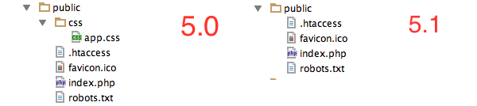

# Laravel5.0を2日触ったばかりの人が5.1にあげた話


## 自己紹介

こん：@konkon1234

猫がいる会社( http://www.qnote.co.jp/ )で働いています


Laravelは4.0をかなり前に触ってからほぼノータッチ<br />
その時に作ったのはこちら http://crossl.net/reader

担当者1人の業務が降ってきたので今週から触ってる


## アジェンダ

* composerで5.0から5.1へ更新してみた
* 5.1をプロジェクトから作り直してみた


## 祝Laravel5.1リリース


## 祝Laravel5.1リリース

5.1はLTS（Long Term Support）

* バグフィックスは2年間
* セキュリティフィックスは3年間


## 祝Laravel5.1リリース

ということで今週から作り始めたプロジェクトを5.0から5.1にあげてみました


## composerで5.0から5.1へ

<div class="fragment">
何も確認せずにcomposer.jsonの"laravel/framework": "5.0.*" を "laravel/framework": "5.1.*"に変更してcomposer update！
</div>

<div class="fragment"
<br />
<br />
必要なディレクトリがなくてこけました


</div>


## composerで5.0から5.1へ

bootstrap/cache フォルダを作成する必要があります


## composerで5.0から5.1へ

アップデートが完了しても

<div class="fragment">
ユニットテストがこけました


</div>


## composerで5.0から5.1へ

unittestを通すにはtests/TestCase.phpに下の変数を追加する必要があります<br />
<pre><code>protected $baseUrl = 'http：//localhost';</code></pre>


## composerで5.0から5.1へ

このような変更が必要な箇所をまとめたアップグレードガイドがありますのでそちらで確認を！

http://laravel.com/docs/5.1/upgrade#upgrade-5.1.0


## composerで5.0から5.1へ

自分のプロジェクトはまだ動き出して2日程度だったのでcreate-projectから作り直しました


## 5.1をプロジェクトから作り直してみた


## プロジェクトから作り直すと

<div class="fragment">
configの景色が違う！


</div>


## プロジェクトから作り直すと

5.1はクラス名をclassキーワードで指定。<br />

オートコンプリートが効く！

綴りミスなどが無くなる！


## プロジェクトから作り直すと

namespaceの宣言位置が違う！


## プロジェクトから作り直すと

<?phpの開始タグの横に記述されていたnamespaceの場所が改行されている
<small>（psr-2準拠？ 具体的なnamespaceの宣言位置に関する文言は見つけられず）</small>

<div class="fragment">
    フレームワークに合わせて自分のコードの宣言位置を<?php開始タグの横に記述していた場合は悲しいことになります
</div>


## プロジェクトから作り直すと

あのファイルがあったりなかったりして


## プロジェクトから作り直すと

5.0ではデフォルトであったオシャレ認証ページが


## プロジェクトから作り直すと

5.0ではデフォルトであったオシャレ認証ページが<br />
ない！


## プロジェクトから作り直すと

でも焦らない

作り方が公式サイトに載っています

http://laravel.com/docs/5.1/authentication#authentication-quickstart

<div class="fragment">
このページ通りに作業をすると
</div>


## プロジェクトから作り直すと

プログラマに馴染み深いデザインのログインページができました


## プロジェクトから作り直すと

5.0にはあったcssフォルダが5.1には存在しません



<div class="fragment">
結局デザインはサイト毎に変わるのでこっちの方が扱いやすくて個人的には好きです
</div>


## プロジェクトから作り直すと

ログイン後に飛ばすurlをデフォルトの/homeから変更したい場合はAuthControllerに以下のインスタンス変数を定義します

<pre><code>protected $redirectTo = '/dashboard';</code></pre>


## プロジェクトから作り直すと

これだけだとログイン済みの状態で/auth/loginにアクセスすると/homeにリダイレクトされてしまうのでMiddleware/RedirectIfAuthenticated.phpも修正します

```diff
public function handle($request, Closure $next)
{
    if ($this->auth->check()) {
-        return redirect('/home');
+        return redirect('/dashboard');
    }

    return $next($request);
}
```


## まとめ

* composer updateをする場合はちゃんと公式のUpgrade Guideを確認しよう
* create-projectから作り直すと色々スッキリします
<div class="fragment">↑ お勧めです</div>


ご静聴、ありがとうございました